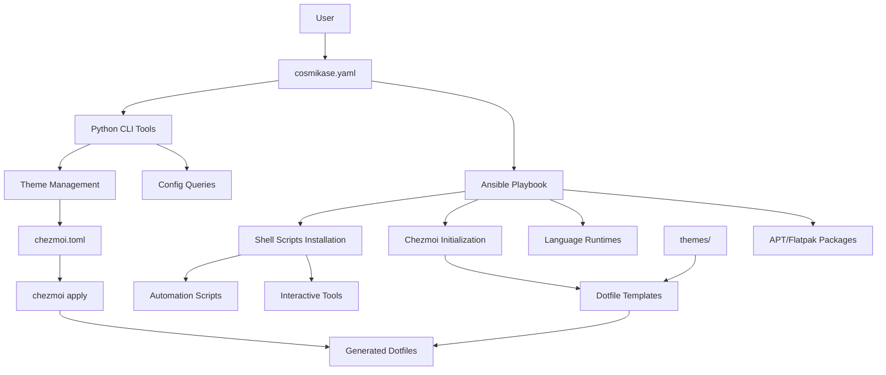
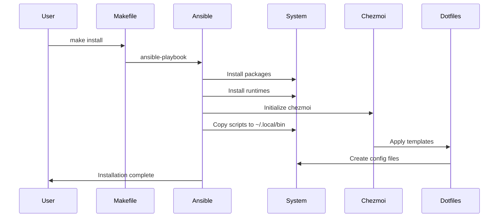
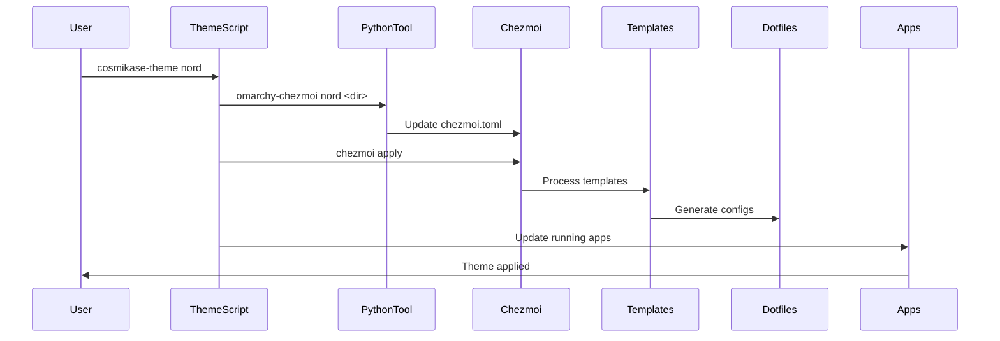
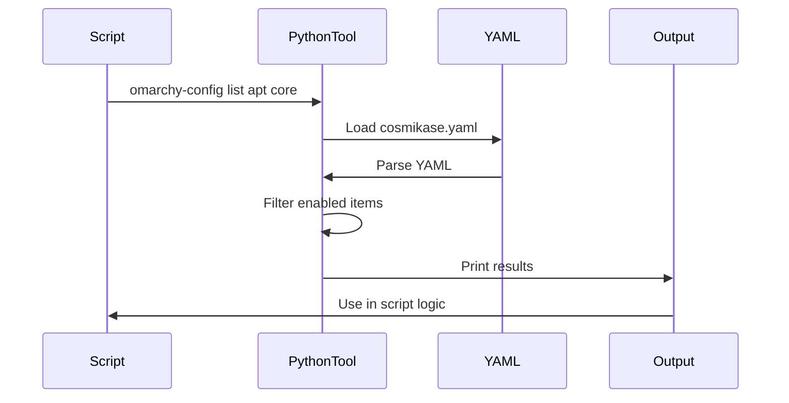
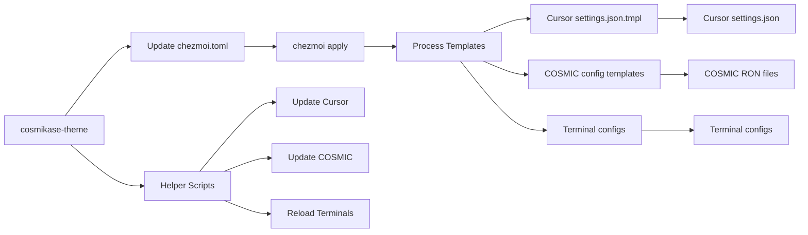
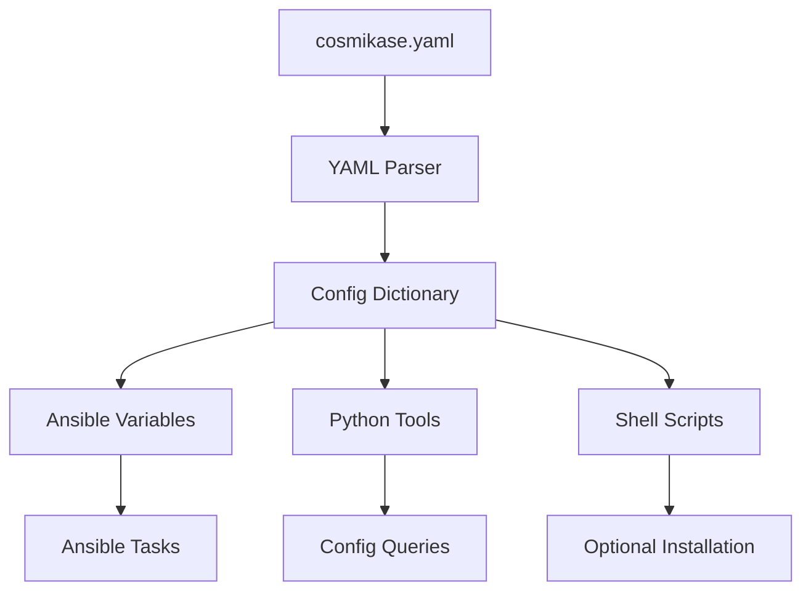
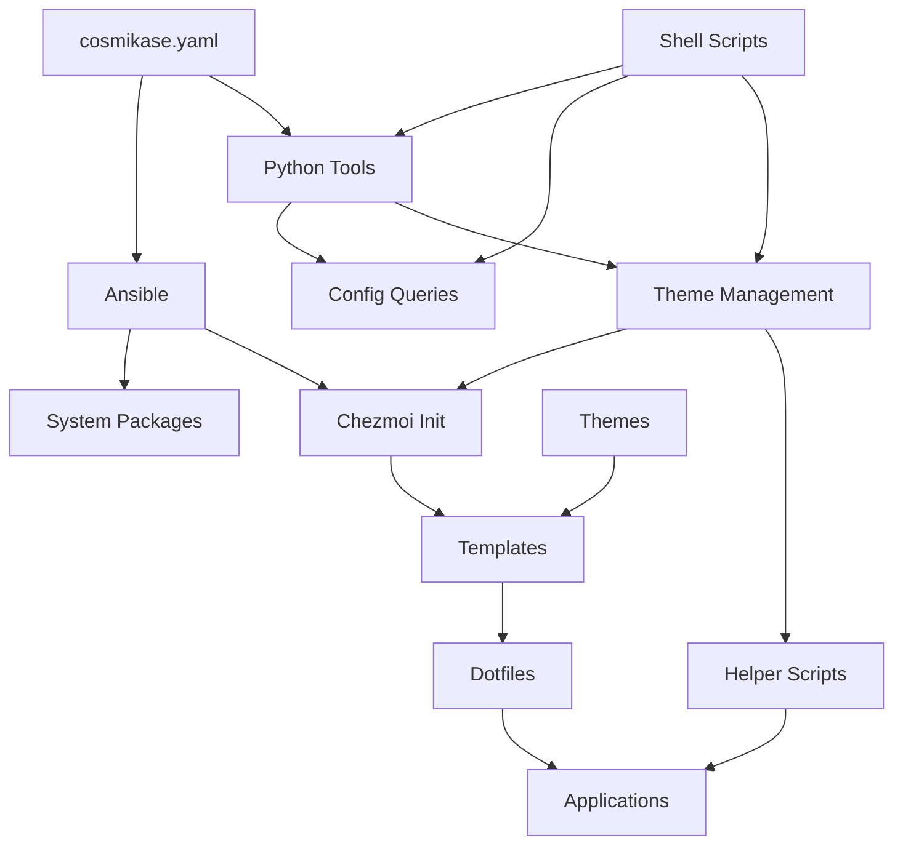

# Architecture Guide

System architecture and component interactions in cosmikase.

## Table of Contents

- [Overview](#overview)
- [System Components](#system-components)
- [Data Flow](#data-flow)
- [Installation Pipeline](#installation-pipeline)
- [Theme System](#theme-system)
- [Configuration Processing](#configuration-processing)
- [Ansible Roles](#ansible-roles)
- [Chezmoi Integration](#chezmoi-integration)

---

## Overview

cosmikase is a configuration management system for Pop!_OS that combines:

- **Ansible** for system-level package installation and configuration
- **chezmoi** for user dotfile management with templating
- **Python CLI tools** for configuration querying and theme management
- **Shell scripts** for interactive utilities and automation



---

## System Components

### 1. Configuration File (`cosmikase.yaml`)

**Purpose:** Central configuration file that controls what gets installed and configured.

**Location:** Repository root (or specified via `--config`)

**Structure:**
- Top-level sections: `defaults`, `apt`, `flatpak`, `installers`, `npm`, `uv_tools`, `themes`
- Each section contains groups or lists of items
- Items have `install` flags to control installation

**Processing:**
- Loaded by Ansible playbook via `from_yaml` filter
- Queried by Python CLI tools (`omarchy-config`)
- Used by shell scripts for optional software installation

### 2. Ansible Playbook

**Purpose:** System-level installation and configuration.

**Location:** `ansible/playbook.yml`

**Roles:**
- `packages`: Install APT and Flatpak packages
- `runtimes`: Install language runtimes (Rust, Bun, Node.js, etc.)
- `ghostty`: Build Ghostty terminal from source
- `tools`: Install AI tools and security software
- `dotfiles`: Initialize chezmoi and install dotfiles

**Execution:**
```bash
make install  # Runs ansible-playbook
make dry-run  # Check mode (no changes)
```

### 3. Chezmoi

**Purpose:** Dotfile management with templating support.

**Configuration:** `~/.config/chezmoi/chezmoi.toml`

**Source Directory:** `chezmoi/` (repository)

**Templates:**
- Use Go template syntax
- Access theme data via `.theme` and `.themes_dir` variables
- Generate files in `~/.config/`, `~/.local/`, etc.

**Workflow:**
1. Templates in `chezmoi/dot_config/` are processed
2. Theme-specific values are injected
3. Generated files are placed in home directory
4. Symlinks or copies created as needed

### 4. Python CLI Tools

**Location:** `src/cosmikase/`

**Tools:**
- `omarchy-config`: Query YAML configuration
- `omarchy-chezmoi`: Update chezmoi data
- `omarchy-validate-ron`: Validate RON files
- `omarchy-themes-dir`: Discover themes directory
- `theme-tui`: Interactive theme browser

**Installation:** Via `uv` (Python package manager)

### 5. Shell Scripts

**Location:** `bin/`

**Scripts:**
- `cosmikase`: Interactive menu
- `cosmikase-theme`: Theme switching
- `cosmikase-update`: System updates
- `cosmikase-install`: Optional software installer
- `cosmikase-databases`: Docker database setup
- `omarchy-cursor-extensions`: Extension management
- `omarchy-power-helper`: Power profile management

**Installation:** Copied to `~/.local/bin/` by Ansible

### 6. Theme System

**Location:** `themes/`

**Structure:**
- Each theme is a directory (e.g., `themes/nord/`)
- Contains application-specific config files
- `theme.yaml` provides metadata and color definitions

**Application:**
- Theme name stored in `chezmoi.toml`
- Templates reference theme files
- Helper scripts update running applications

---

## Data Flow

### Installation Flow



### Theme Switching Flow



### Configuration Query Flow



---

## Installation Pipeline

### Phase 1: Prerequisites

1. **Check dependencies:**
   - `uv` (Python package manager)
   - `ansible` (via uv)
   - `chezmoi` (installed if missing)

2. **Load configuration:**
   - Read `cosmikase.yaml`
   - Extract sections and defaults
   - Validate structure

### Phase 2: Package Installation

1. **Update package caches:**
   - `apt update`
   - `flatpak update --appstream`

2. **Install APT packages:**
   - Core tools
   - GUI applications
   - Terminal emulators
   - YubiKey packages (if enabled)

3. **Install Flatpak applications:**
   - Utility apps
   - Productivity tools
   - Communication apps

### Phase 3: Runtime Installation

1. **Install language runtimes:**
   - Rust (via rustup)
   - Bun (via install script)
   - Node.js (via nvm)
   - Julia (via juliaup)
   - uv (if not present)

2. **Install global packages:**
   - NPM packages
   - uv tools (Python CLI tools)

### Phase 4: Build from Source

1. **Ghostty terminal:**
   - Clone source (if not exists)
   - Build with Zig
   - Install to `~/.local/bin/`

### Phase 5: Dotfile Setup

1. **Initialize chezmoi:**
   - Create config directory
   - Set theme data in `chezmoi.toml`
   - Initialize source directory

2. **Sync themes:**
   - Copy themes from repo to `~/.local/share/cosmikase/themes/`

3. **Install scripts:**
   - Copy shell scripts to `~/.local/bin/`
   - Make executable

4. **Apply dotfiles:**
   - Process templates
   - Generate config files
   - Create symlinks

5. **Shell integration:**
   - Add PATH to `.bashrc`/`.zshrc`
   - Source cosmikase scripts

---

## Theme System

### Theme Directory Structure

```
themes/
├── nord/
│   ├── theme.yaml          # Metadata and colors
│   ├── cosmic.ron          # COSMIC desktop theme
│   ├── cursor.json         # Cursor theme mapping
│   ├── ghostty.conf        # Ghostty colors
│   ├── kitty.conf          # Kitty colors
│   ├── alacritty.toml      # Alacritty colors
│   ├── nvim.lua            # Neovim colors
│   ├── btop.theme          # btop colors
│   ├── starship.toml       # Starship prompt
│   ├── antigravity.conf    # Antigravity colors
│   └── backgrounds/        # Wallpapers
│       └── *.png
└── ...
```

### Theme Application Process



### Theme Data Flow

1. **Theme Selection:**
   - User runs `cosmikase-theme <name>`
   - Script validates theme exists

2. **Chezmoi Update:**
   - `omarchy-chezmoi` updates `chezmoi.toml` with theme name
   - Theme directory path stored

3. **Template Processing:**
   - Chezmoi processes templates in `chezmoi/dot_config/`
   - Templates access `.theme` and `.themes_dir` variables
   - Theme-specific files referenced

4. **Config Generation:**
   - Generated files placed in `~/.config/`
   - Applications read their configs

5. **Live Updates:**
   - Helper scripts update running applications
   - Cursor: Reload window
   - COSMIC: Update RON files directly
   - Terminals: Send reload signals

---

## Configuration Processing

### YAML Loading



### Item Filtering

Items are filtered based on `install` flag:

1. **Default behavior:**
   - If `defaults.install` is `true`, items default to `install: true`
   - If `defaults.install` is `false`, items default to `install: false`

2. **Explicit flags:**
   - `install: true` → Include in installation
   - `install: false` → Skip (available via `cosmikase-install`)

3. **Filtering logic:**
   ```python
   if item.get("install", defaults.install):
       # Include in installation
   else:
       # Skip (optional)
   ```

### Section Processing

**APT Packages:**
- Grouped by category (core, gui, terminal, yubikey)
- Filtered by `install` flag
- Installed via `ansible.builtin.apt`

**Flatpak Apps:**
- Grouped by category (utility, productivity, communication)
- Filtered by `install` flag
- Installed via `community.general.flatpak`

**Installers:**
- Custom installation methods
- Script execution, deb downloads, npm/bun installs
- Handled by Ansible roles

---

## Ansible Roles

### Role: packages

**Location:** `ansible/roles/packages/`

**Responsibilities:**
- Install APT packages from config
- Install Flatpak applications
- Handle package groups separately

**Key Tasks:**
- Update apt cache
- Install core packages
- Install GUI packages
- Install terminal packages
- Install YubiKey packages (if enabled)
- Install Flatpak apps by group

### Role: runtimes

**Location:** `ansible/roles/runtimes/`

**Responsibilities:**
- Install language runtimes
- Set up version managers
- Configure global packages

**Key Tasks:**
- Install Rust (rustup)
- Install Bun
- Install Node.js (nvm)
- Install Julia (juliaup)
- Install uv
- Install NPM global packages
- Install uv tools

### Role: ghostty

**Location:** `ansible/roles/ghostty/`

**Responsibilities:**
- Build Ghostty terminal from source
- Install Zig if needed
- Handle build dependencies

**Key Tasks:**
- Check for Zig installation
- Clone Ghostty source
- Build with Zig
- Install binary
- Update desktop integration

### Role: tools

**Location:** `ansible/roles/tools/`

**Responsibilities:**
- Install AI coding tools
- Install security tools
- Handle custom installers

**Key Tasks:**
- Install Cursor (deb)
- Install Antigravity
- Install Codex (npm)
- Install OpenCode (bun)
- Install Claude Code
- Install Brave browser
- Install Dangerzone

### Role: dotfiles

**Location:** `ansible/roles/dotfiles/`

**Responsibilities:**
- Initialize chezmoi
- Sync themes
- Install shell scripts
- Apply dotfiles
- Set up shell integration

**Key Tasks:**
- Install chezmoi (if missing)
- Create themes directory
- Sync themes from repo
- Copy scripts to `~/.local/bin/`
- Initialize chezmoi
- Configure chezmoi data
- Apply dotfiles
- Add shell integration

---

## Chezmoi Integration

### Template System

**Template Location:** `chezmoi/dot_config/`

**Template Syntax:** Go templates

**Variables Available:**
- `.theme`: Current theme name
- `.themes_dir`: Path to themes directory
- `.font_family`: Font family name
- `.font_size`: Font size
- `.padding`: Padding value

**Example Template:**
```go
{{- if eq .theme "nord" }}
"workbench.colorTheme": "Nord",
{{- else if eq .theme "catppuccin" }}
"workbench.colorTheme": "Catppuccin Mocha",
{{- end }}
```

### Configuration File

**Location:** `~/.config/chezmoi/chezmoi.toml`

**Structure:**
```toml
[data]
theme = "nord"
themes_dir = "/home/user/.local/share/cosmikase/themes"
font_family = "JetBrainsMono Nerd Font"
font_size = 9
padding = 14
```

**Update Process:**
1. `omarchy-chezmoi` reads existing config
2. Updates `[data]` section atomically
3. Preserves other chezmoi settings

### Dotfile Application

**Process:**
1. Chezmoi reads templates from source directory
2. Processes templates with data variables
3. Generates files in destination
4. Creates symlinks or copies as configured

**Destination Mapping:**
- `chezmoi/dot_config/` → `~/.config/`
- `chezmoi/dot_local/` → `~/.local/`
- `chezmoi/dot_*` → `~/.`

---

## Component Dependencies



---

## File Locations

### Configuration Files

| File | Location | Purpose |
|------|----------|---------|
| `cosmikase.yaml` | Repository root | Main configuration |
| `~/.config/chezmoi/chezmoi.toml` | User config | Chezmoi data |
| `ansible/playbook.yml` | Repository | Ansible playbook |
| `ansible/inventory.yml` | Repository | Ansible inventory |

### Generated Files

| File | Location | Source |
|------|----------|--------|
| `~/.config/Cursor/User/settings.json` | User config | `chezmoi/dot_config/Cursor/User/settings.json.tmpl` |
| `~/.config/cosmic/...` | User config | `chezmoi/dot_config/cosmic/...` |
| `~/.config/zellij/config.kdl` | User config | `chezmoi/dot_config/zellij/config.kdl.tmpl` |
| `~/.config/shell/cosmikase.sh` | User config | `chezmoi/dot_config/shell/cosmikase.sh.tmpl` |

### Scripts and Tools

| Item | Location | Purpose |
|------|----------|---------|
| Shell scripts | `~/.local/bin/` | User executables |
| Python tools | Via `uv` | CLI utilities |
| Themes | `~/.local/share/cosmikase/themes/` | Theme files |

---

## Extension Points

### Adding New Themes

1. Create theme directory in `themes/`
2. Add theme files (cosmic.ron, cursor.json, etc.)
3. Create `theme.yaml` with metadata
4. Update theme mapping in Cursor template if needed

### Adding New Packages

1. Add to `cosmikase.yaml` in appropriate section
2. Ansible role will install automatically
3. No code changes needed

### Adding New Dotfiles

1. Create template in `chezmoi/dot_config/`
2. Use template variables for theme-specific values
3. Chezmoi will generate file on apply

### Creating New Scripts

1. Add script to `bin/`
2. Make executable (`chmod +x`)
3. Add to Ansible role to copy to `~/.local/bin/`

---

## See Also

- [CLI Reference](cli-reference.md) - Command documentation
- [Configuration Reference](configuration-reference.md) - Config schema
- [Development Guide](development.md) - Contributing guide
- [Troubleshooting Guide](troubleshooting.md) - Common issues

